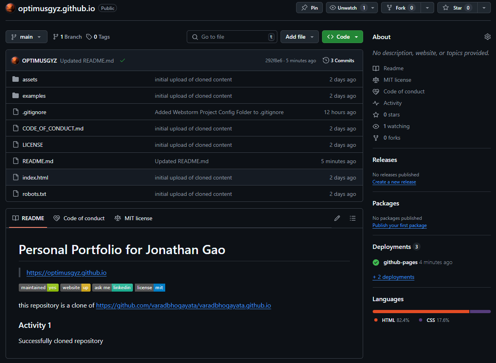
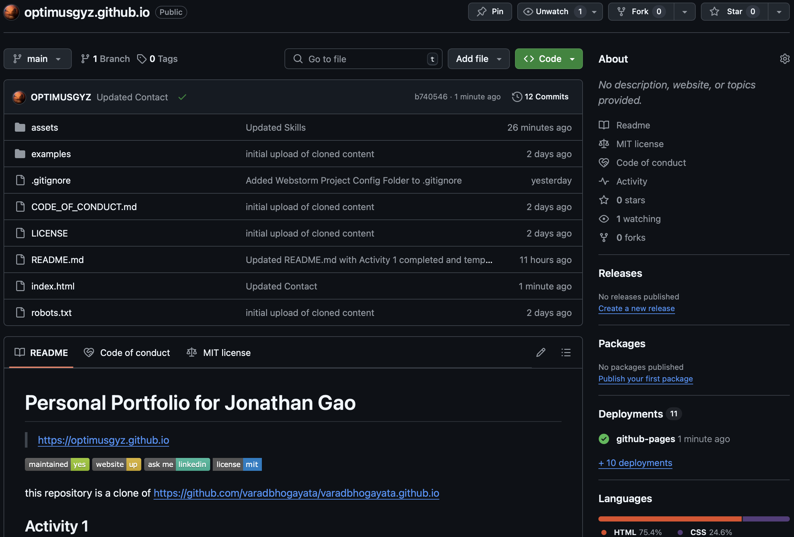
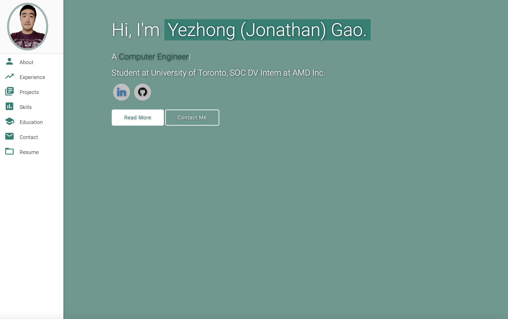
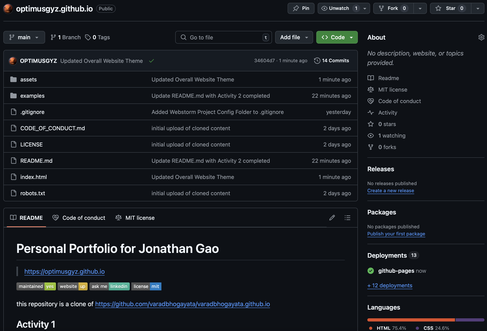
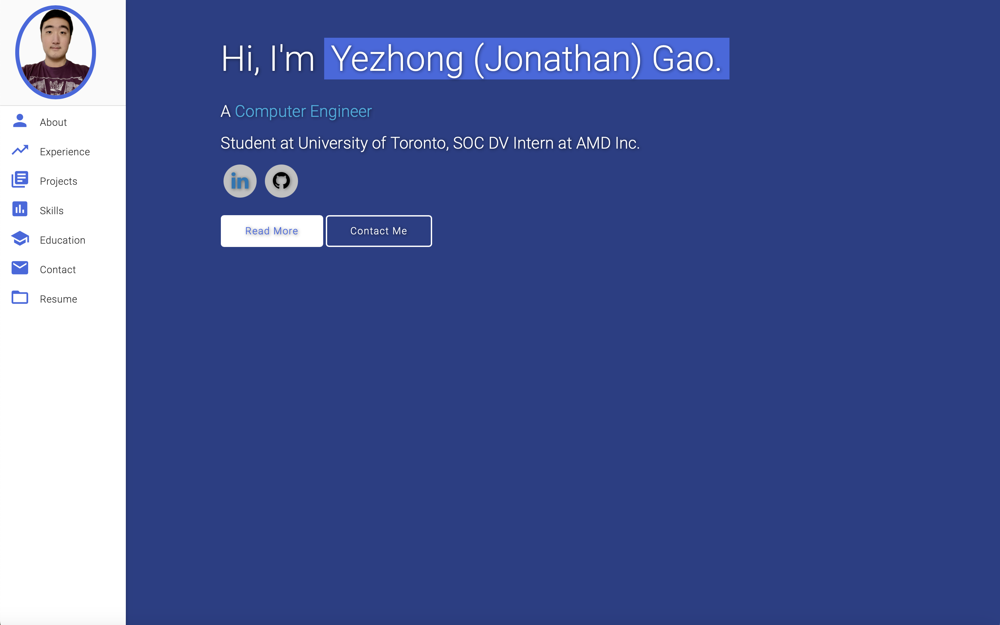
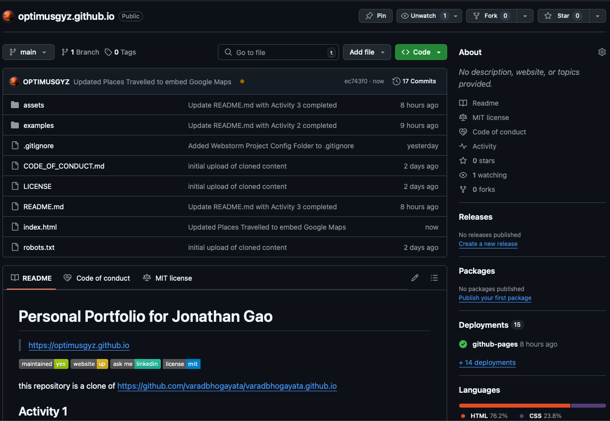
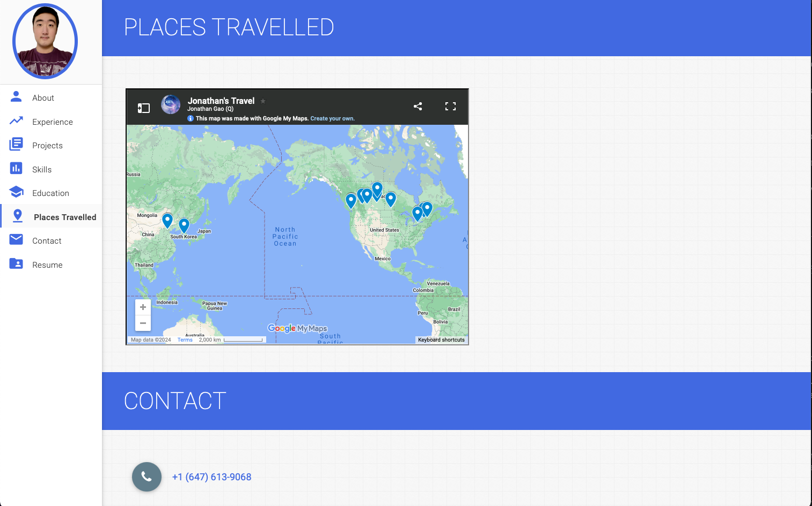
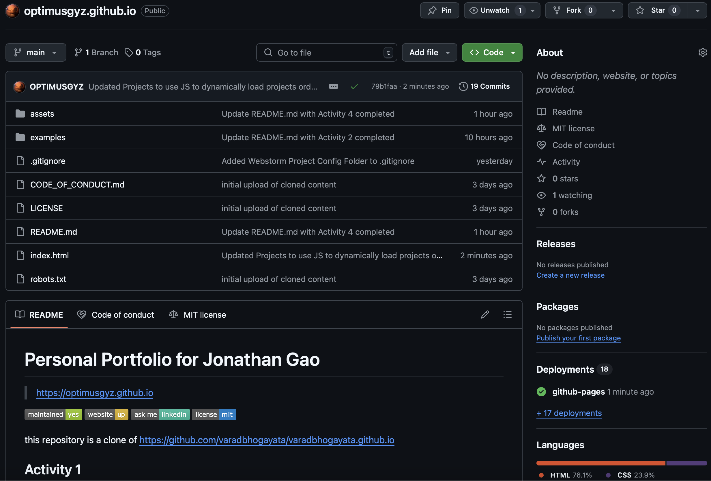
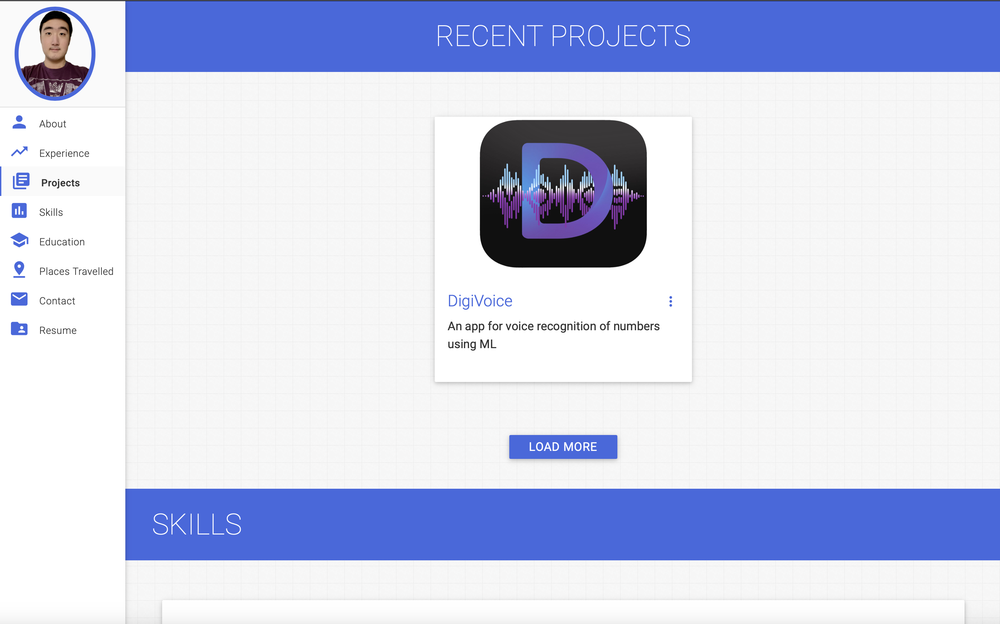
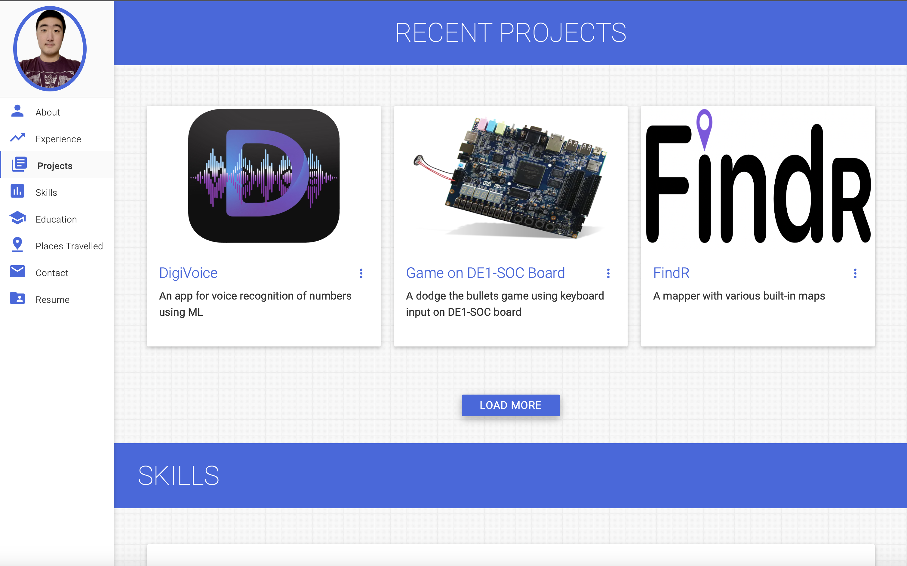

# Personal Portfolio for Jonathan Gao
> https://optimusgyz.github.io

this repository is a clone of
https://github.com/varadbhogayata/varadbhogayata.github.io

## Activity 1
### Successfully cloned repository

## Activity 2
### Repository (Personal Information Updates)

### Home Page of Deployed Website

## Activity 3
### Repository (Website Theme Updates)

### Home Page of Website

## Activity 4
### Repository (Places Traveled)

### Places Traveled Section of Website

## Activity 5
### Repository (Recent Projects using JS)

### Recent Projects Section of Website

